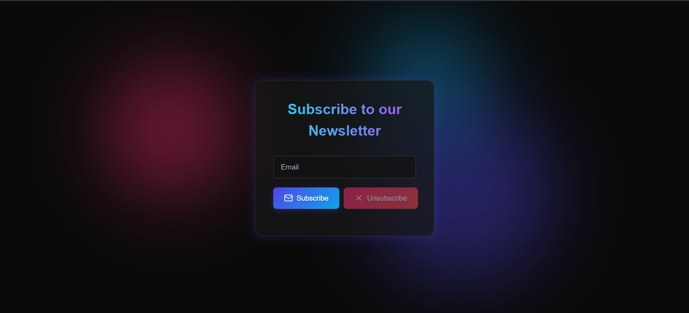

# Newsletter Subscription App

A modern React application for managing newsletter subscriptions with real-time status checking and beautiful UI animations.



## 🚀 Features

- 📧 Email subscription management
- ⚡ Real-time subscription status checking
- 🎨 Modern UI with neon animations
- ✉️ Email validation
- 📱 Fully responsive design
- 🔔 Success/Error notifications

## 🛠️ Tech Stack

- React 19
- Axios for API calls
- Lucide React for icons
- CSS3 with custom animations
- Environment variables support

## 📦 Installation

1. Clone the repository:
```bash
git clone https://github.com/yourusername/newsletter-frontend.git
cd newsletter-frontend
```

2. Install dependencies:
```bash
npm install
```

3. Create a `.env` file in the root directory:
```env
REACT_APP_API_URL=http://localhost:9000
```

4. Start the development server:
```bash
npm start
```

## 🗂️ Project Structure

```
newsletter-frontend/
├── public/
├── src/
│   ├── components/
│   │   └── Home.jsx
│   ├── styles/
│   │   └── Home.css
│   ├── App.js
│   └── index.js
├── .env
├── .gitignore
└── package.json
```

## ⚙️ Available Scripts

- `npm start` - Run development server
- `npm test` - Run test suite
- `npm run build` - Build for production
- `npm run eject` - Eject from Create React App

## 🔑 Environment Variables

| Variable | Description | Default |
|----------|-------------|---------|
| `REACT_APP_API_URL` | Backend API URL | `http://localhost:9000` |

## 🔌 API Integration

The app connects to these endpoints:

```javascript
${REACT_APP_API_URL}/check-status  // Check subscription status
${REACT_APP_API_URL}/subscribe     // Subscribe email
${REACT_APP_API_URL}/unsubscribe   // Unsubscribe email
```

## 🎯 Component Features

### Home Component
- Email input with validation
- Real-time subscription status checking
- Subscribe/Unsubscribe functionality
- Animated status messages
- Neon background effects

## 🤝 Contributing

1. Fork the repository
2. Create your feature branch (`git checkout -b feature/amazing-feature`)
3. Commit changes (`git commit -m 'Add amazing feature'`)
4. Push to branch (`git push origin feature/amazing-feature`)
5. Open a Pull Request

## 📝 License

This project is licensed under the MIT License - see the [LICENSE](LICENSE) file for details.

## 📧 Contact

Your Name - [@AvanisHCodes_](https://twitter.com/AvanisHCodes_)


## Click here to check out the **backend Link**: [https://github.com/AvanishVadke/newsletter-backend](https://github.com/AvanishVadke/Backend-for-SQL-nodemailer-newsletter-app/tree/main)
